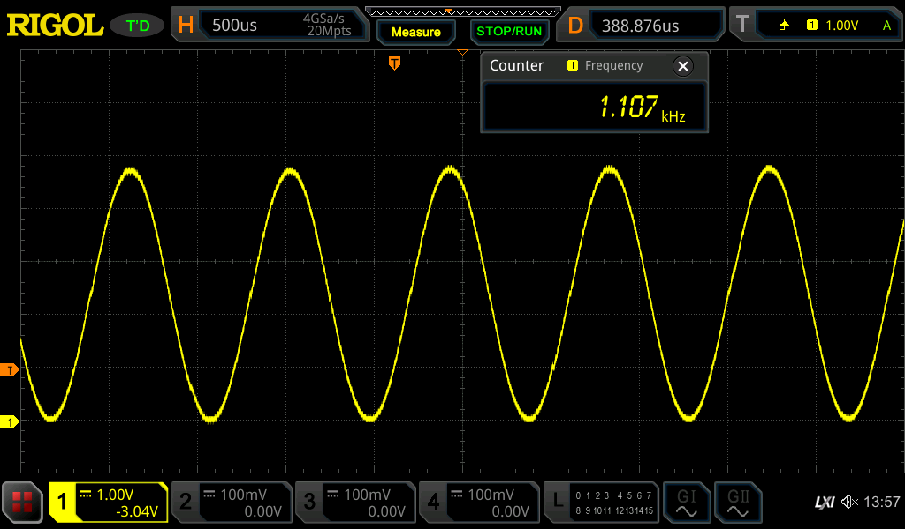
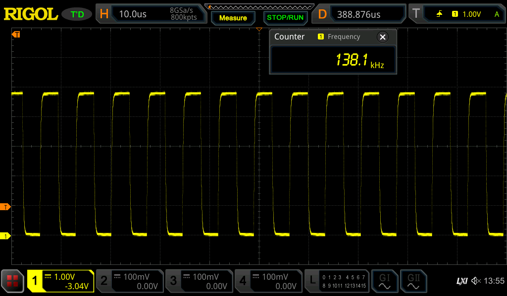

# AVR-SignalGenerator

This program is meant for AVR based boards especially for 8bit MCUs from Atmel (ATmega 128, ATmega 328p, ATmega 2560... etc.)
Some MCUs have different register naming for timers, port mapping etc... please check it before usage!
This program is developed on Arduino Mega2560 and later is imported onto ATmega 128.

## What does it do?
1. It's meant to be a 2 Channel signal generator.
2. To change waveforms you will need to communicate via serial line. (Arduino = USB, ATmega128 RS232)
3. You will be able to change frequency and waveform type and max amplitude
4. It's unable to output AC signal because it's missing OP-Amp so max pK-pK voltage is 5V (0V-5V)
5. It's only using 8bit DAC so it's not super high res. but good enough.

For my testing purposes I do not have DAC converting IC, so I'm using only resistor ladder to create an analog signal on output.

## Communication commands
Dirty simple protocol: (channel number 1-2)(wave type char)(amplitude 0-255)(space char)(sample rate 2-255)(space char)(frequency delay 0-255)  
**What each letter stands for?**  
s - sine wave  
t - triangle wave  
w - sawtooth wave  
e - square wave  

Command examples (baud rate: 9600, command termination is with: \n):
```
1s255 255 000
```
-> 1. exmaple: sine wave on channel 1 with max amplitude and max sample rate and zero frequency delay
```
1e255 002 000
```
-> 2. example: square wave on channel 1 with max amplitude and min sample rate and zero frequency delay
## Waveform examples


## Licence
All code is MIT so do with it what ever you want...
**EXCEPT**  
Not sure about my teacher's own serial communication library for ATmega 128 over RS232 [header code](/include/usart.h) / [src code](/src/usart.c)
Feel free to contact him, he's usually a nice guy :D his email: kolousek@spscv.cz
